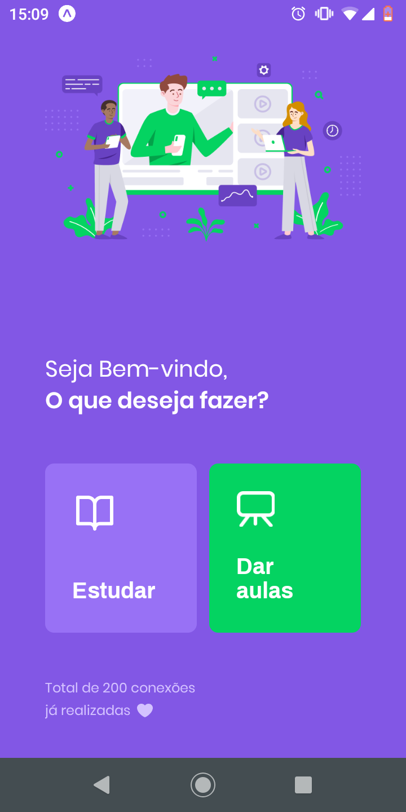
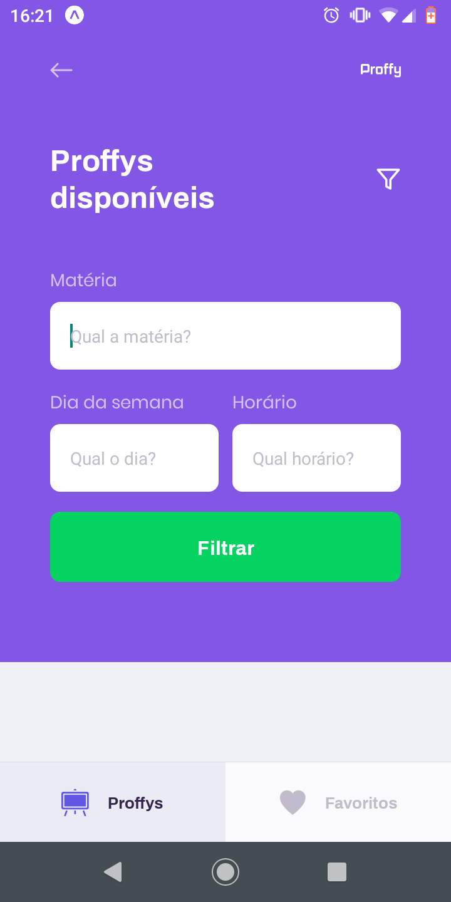
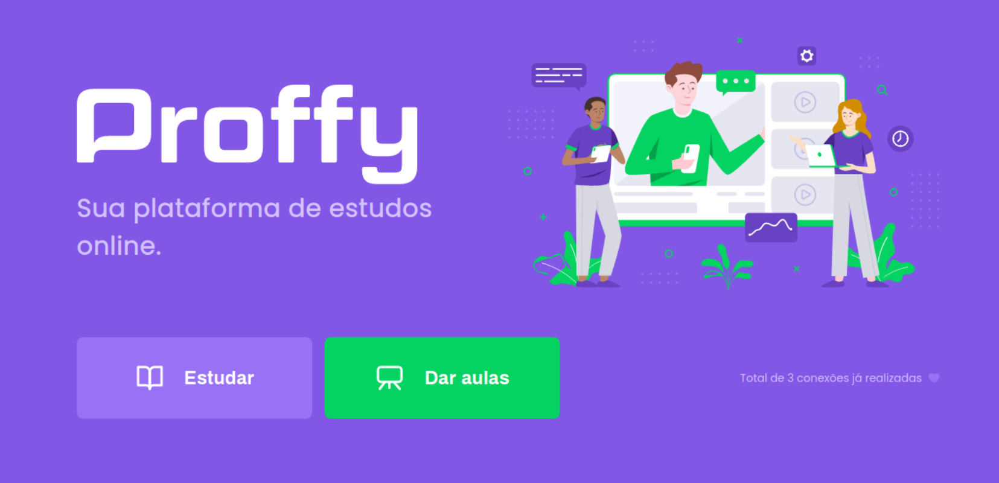

# Proffy
Uma aplicação que conecta alunos à professores, desenvolvida durante a NextLevelWeek2.

Tela inicial                                                  | Tela de pontos de coleta             |  Detalhes do ponto de coleta
:------------------------------------------------------------:|:-------------------------:|:-------------------------:
      |   | 

## 1º Dia
Neste primeiro dia da Nlw foi reforçado o funcionamento do React, e os componentes.
Foi introduzido o conceito de SPA (Single Page Applications) a qual denota
uma aplicação de uma única página e que não recarrega seu conteúdo.
Também foi introduzido o conceito de Mobile First, uma metodologia a qual
visa priorizar o desenvolvimento da parte mobile da aplicação. E por fim,
para aplicar o conceito de Mobile First, foi necessário que a aplicação
possua responsividade entre mobile e desktop, para isso, foi necessário
o uso da unidade de medida REM do css, em conjunto com a reservada do
css @media, a qual possibilita a alteração dos estilos baseada em uma
propriedade do css, neste caso o tamanho mínino da div container.

## 2º Dia
No segundo dia foi desenvolvido o backend da aplicação, onde foram apresentados
os conceitos e ferramentas de criação de banco de dados, utilizando a dependência
knex.js a qual cria esquemas de bancos de dados através do sistema de migrations
e, faz interação com o banco de dados através de query builder.
Foram desenvolvidas quatro rotas, as quais foram organizadas de acordo com o
padrão MVC, e essas rotas servem para o cadastro de aulas, criação de conexões,
listagem de aulas e listagem de conexões, respectivamente.

## 3º Dia
No terceiro dia, foi finalizado o frontend web, mais especificamente a tela
TeacherList, a qual foram introduzidos os conceitos de estado com o useState
e a função useEffect. O frontend web foi conectado com o servidor através da
dependência axios, utilizando uma url base e as rotas previamente definidas.

## 4º Dia
No quarto dia, foi criada a aplicação mobile utilizando react native e o
expo. Nesta etapa, o foram mostrados as diferenças entre o ReactJS e o
react native. Foram criadas as telas da aplicação e a navegação utilizando
o react-navigation. As telas foram estilizadas e os componentes principais
da aplicação foram posicionados.

# 5º Dia
No quinto dia, foram feitas as alterações finais na aplicação como os últimos
componentes a serem utilizados, e a conexão com o backend. A comunicação com
a API foi realizada através da dependência *Axios* que funciona de uma
maneira muito similar ao ReactJS. Também foi realizado uma operação de armazenamento
no dispositivo, conhecido como *AsyncStorage*, essa ferramenta permite a armazenagem
de informação no celular persistente.
